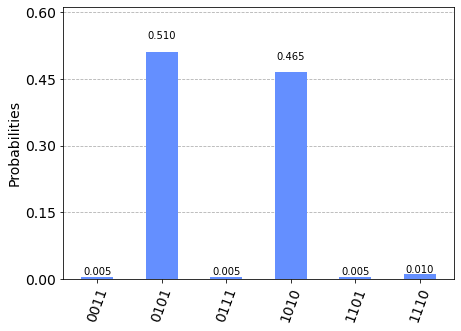
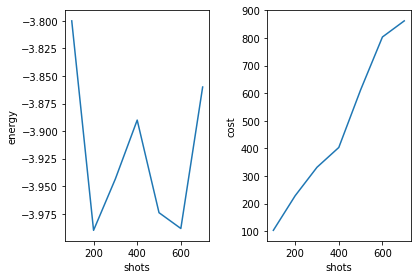
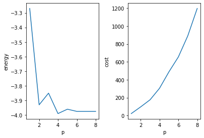
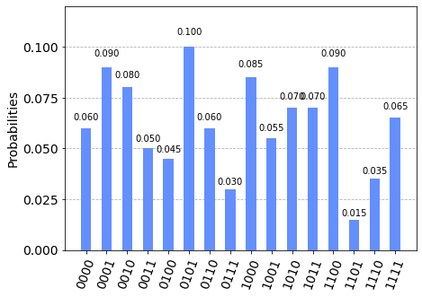
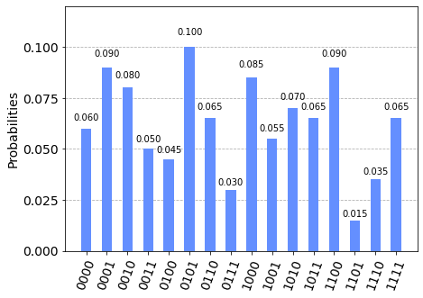

# Quantum Approximate Optimisation Algorithms for Real World Scenarios --- Strangeworks
Womanium Quantum Hackathon 2022

## Team Jumpstart Quantum
Team Members:
  <pre>David Liu      Discord: DavidQuantum#9131    Github: davidlearn    Email: Liud@pfw.edu </pre>
  <pre>Yiping Wang    Discord: yiping#1999          Github: wyp7          Email: yipingwang2023@u.northwestern.edu </pre>
  <pre>Jiaqi Guo      Discord: Emrysguo#0793        Github: emrysguo      Email: jiaqiguo@andrew.cmu.edu </pre>

Team Pitch Presenter: Jiaqi Guo

## Team Jumpstart Quantum Hackathon Challenge
Quantum Approximate Optimization for Real World Scenarios --- Strangeworks

## Challenge Introduction -- Strangeworks
Current noisy intermediate scale quantum computers (NISQ) may be well suited to solving quantum approximate optimisation algorithms (QAOA) with some promising initial proof of principle results. These can be applied to solve a wide variety of problems such as the max-cut or traveling salesman problems, which are extremely relevant to real world scenarios useful for optimizing global supply chains for example. Classically they are extremely difficult to solve for an optimal solution, with a computational cost that scales exponentially with the number of parameters. 
We find that what many of our partners really want at this stage is to know how much quantum solutions to these problems are going to cost! This is very important because time on quantum hardware is currently extremely expensive. While they of course are interested in defining and quantifying how well these methods will actually work, their real world budgeting constraints is what will most impact the viability as far as they see it. 
This project will involve creating and testing a QAOA algorithm on a chosen graph. The accuracy of this method will then be tested upon varying the number of classical optimization steps, the depth of the quantum circuit and the number of measurements required on the quantum device at each step etc. This will then allow us to define the total classical hardware time and the total quantum hardware time, giving us an initial estimate for the overall cost of running such an algorithm.
For many real world scenarios we do not necessarily need the most optimal solution, just one that is better than those currently utilized, so we will be judging submissions based on an analysis which balances the overall cost of the routine with the quality of the solution. Additional points will be given for the presentation and interpretation of the data in terms of the viability of these methods as the graph size and complexity are increased. We will also be looking for more advanced offerings, such as methods for post processing the quantum measurement results to better refine the classical solution of the graph and sufficient explorations in the space of connected graphs as well as explorations of the parameter space for the variational coefficients.

## Team Challenge Objectives
- understand how QAOA solves combinatorial optimization problems in even NISQ era and potentially beats classical algorithms
- explore how QAOA solves a weight Max-Cut optimization problem in Qiskit quantum circuit implementation
- study how QAOA circuit depth <b>p</b> measurement shots, and the percetange of quantum output processed as input to the classical optimization solver affect the <b>optimization</b> value (energy in Hamiltonian system) and <b>cost</b>
- Discussed how to assess how to measure QAOA resolution vs ultimate optimal solution
- investigate how to optimize QAOA for accuracy and computing time in term of the initialization of variational parameter of (β, $\boldsymbol{\gamma}$) and the circuit depth <b>p</b>
- Investigate how to scale QAOA to solve large optimization problems with the limited qubit size in current quantum computers

## Team Challenge Findings
In the experiment, we demonstrate the variational parameters to be depth <b>p</b>,  shots, and the rate of quantum measure average over top, while the measurement results including energy and the cost of each running. We separately test the experiments in standard qiskit simulator and qiskit noisy simulator for comparing the noise effect in our results. The testing problem here we choose the max-cut as our main focus.

In addition, We described several ways to sclae QAOA to solve larger optimization problem with the current NISQ computers with limitted qubits and quantun circuits.
Further, We investigated several ways to sclae QAOA to solve larger optimization problem with the current NISQ computers with limitted qubits and quantun circuits.

QAOA has the potential to solve the large size combinatorial optimization problems and demonstrate the quantum advantage and supremacy. QAOA will help to solve the many of problems such as supply chain optimization, vehicle routing, semiconductor chip design, product or financial assest portfolio optimzation. For NISQ computers, noise environments cause quantum measured outputs spread out widely and the probabilities for optimal solutions are much lower compared to fault tolerant quantum computers. It is very important to develop techniques to initialize the quantum states and variational parameters. For larger problems, we need to investigate the necessary quantum circuit depth p to obtain good and achievable optimization solutions. It will be essential to always minimize the size of quantum circuits for QAOA for any combinatorial optimization problems.

## Team Challenge Presentation
Our team presentation is avaiable here 
<a href="Jumpstart_QAOA_Presentation.pptx"> Jumpstart QAOA Presentation in ppt</a>

<a href="Jumpstart_QAOA_Presentation.pdf"> Jumpstart QAOA Presentation in pdf</a>

### Quantum QAOA Experiments
### On a standard Qiskit simulator, the QAOA experiments are run in following conditions:
- p: 1 to 8, shots: 200, quantum measure average over top: 100%
  
  We init the shots to be 200 and quantum measure average over top to be 100%. Here the energy changes and cost changes with respected to depth <b>p</b> are shown below. As we can see the energy has negative relation with depth <b>p</b> and cost to be positive. While in energy figure, there are small pumps around 2 to 6, shows the best solution is achieved at p = 4.

    
    
    Here we measure for p = 8 and the histogram is plotted below:
  
    
- p: 4, shots: 100 to 700, quantum measure average over top: 100%
  
  While we use optimal depth <b>p</b> = 4 to comparing the shot numbers with respected to energy and cost, we find the lowest two points for energy are 200 and 600 in energy figure and the cost is positive related to shot numbers. Therefore, we find the best solution for depth <b>p</b> = 4 is 200 shots.

    
- p: 1 to 8, shots: 200, quantum measure average over top: 20%
  
  Then we use the optimal shots number to draw the relation of depth <b>p</b> with respected to energy and cost, while change the quantum measure average over top to be 20%, figure plotted below. We see the results are similar to our first condition.

    

  Here we also measure for p = 8 and the histogram is plotted below:

    

  The conclusion is that both solutions with <b>p</b> = 4, shots 200 and two different quantum measure average over top are equally optimal. Also, without knowing the eact solutions for the large problem, we may need to see the trend pf the solution provided by p and determine the best results we can get.

### On a Noisy Qiskit simulator, the QAOA experiments are run in following conditions:
- p: 1 to 8, shots: 200, quantum measure average over top: 100%
  
  For comparison of standard qiskit condition and noisy qiskit condition, we have run the other three experiments with same pairs of variational parameters. Here we set initial input shots as 200 and quantum measure average over top as 100%. Varing the <b>p</b> from 1 to 8, we get energy and cost changes plotted below. The images are similar as the standard qiskit condition with same initial settings.
 
    

   Here we measure for p = 8 and the histogram is plotted below: We see the best solution for noisy simulator is also achieved at <b>p</b> = 4.

    

- p: 4, shots: 100 to 700, quantum measure average over top: 100%
  
  For p = 4, the best solution is achieved for the number of shots at 200 using the noisy simulator. 

    
- p: 1 to 8, shots: 200, quantum measurefor average over top: 20%

    

   Here we also measure for p = 8 and the histogram is plotted below:
  
    

   The results show on the noisy simulator, only one of the two optimal solutions is obtained with probablity 10%, and post processing average over top 20% measurements does not have advantages. 

### The coding detailed information is availalbe in <a href="QAOA_jumpstart.ipynb"> QAOA_jumpstart.ipynb</a>, starting from part III.

## References
1. Farhi, Edward, Jeffrey Goldstone, and Sam Gutmann. "A quantum approximate optimization algorithm." arXiv preprint [arXiv:1411.4028 (2014)](https://arxiv.org/abs/1411.4028).
2. Goemans, Michel X., and David P. Williamson. [Journal of the ACM (JACM) 42.6 (1995): 1115-1145](http://www-math.mit.edu/~goemans/PAPERS/maxcut-jacm.pdf).
3. Garey, Michael R.; David S. Johnson (1979). Computers and Intractability: A Guide to the Theory of NP-Completeness. W. H. Freeman. ISBN 0-7167-1045-5
4. Kandala, Abhinav, et al. "Hardware-efficient variational quantum eigensolver for small molecules and quantum magnets." [Nature 549.7671 (2017): 242](https://www.nature.com/articles/nature23879).
5. Farhi, Edward, et al. "Quantum algorithms for fixed qubit architectures." arXiv preprint [arXiv:1703.06199 (2017)](https://arxiv.org/abs/1703.06199).
6. Spall, J. C. (1992), [IEEE Transactions on Automatic Control, vol. 37(3), pp. 332–341 (https://ieeexplore.ieee.org/document/119632).
7. Michael Streif and Martin Leib "Training the quantum approximate optimization algorithm without access to a quantum processing unit" (2020) Quantum Sci. Technol. 5 034008
8. Zhou, L. et al. "Quantum Approximate Optimization Algorithm: Performance, Mechanism, and
Implementation on Near-Term Devices." arXiv e-prints, art. arXiv:1812.01041, December 2018
9. Beaulieu D. and Pham, A. "MMax-cut Clustering Utilizing Warm-Start QAOA and IBM Runtime." arXiv preprint [arXiv:2108.13464 (2021]
10. Zhou, Z. et al. "QAOA-in-QAOA: solving large-scale MaxCut problems on small quantum machines." arXiv preprint [arXiv.2205.11762]
11. Li, J. et al. "Large-scale Quantum Approximate Optimization via Divide-and-Conquer." arXiv preprint [arXiv: 2102.13288], 2021.
12. Bärtschi, A. and Eidenbenz, S., "Grover Mixers for QAOA: Shifting Complexity from Mixer Design to State Preparation." arXiv preprint [arXiv: 2006.00354], 2020.
13. Harrigan, M.P. Quantum Approximate Optimization of Non-Planar Graph Problems on a Planar Superconducting Processor   https://arxiv.org/abs/2004.04197, accessed Augugt 16, 2022
14. Deloitte, A business leader’s guide to quantum technology, https://www2.deloitte.com/us/en/insights/topics/innovation/quantum-computing-business-applications.html, 2021.